# Silni App - Comprehensive Promotion Strategy

> **Document Purpose**: Complete analysis of current promotional assets and strategic roadmap for reaching real users and selling the app
> **Last Updated**: February 2026
> **Target Audience**: App founder/marketing team

---

## Executive Summary

Silni is a well-built, feature-rich Islamic family connection app with strong technical foundation and clear market fit. However, **promotional assets are severely lacking**. The app has excellent documentation but minimal marketing materials, no social presence, and no user acquisition strategy.

**Key Finding**: The app is ready for users, but users don't know it exists. This document provides a complete roadmap to fix that.

---

## Part 1: Content Audit - What You Have vs What You Lack

### ✅ What You Have (Strong Assets)

| Asset | Status | Quality | Notes |
|-------|--------|---------|-------|
| **Product** | ✅ Excellent | High | Fully functional, feature-rich, well-tested |
| **Technical Documentation** | ✅ Excellent | High | Comprehensive docs, architecture, deployment guides |
| **Product Bible** | ✅ Excellent | High | Clear value proposition, personas, use cases |
| **Financial Projections** | ✅ Excellent | High | Realistic projections, clear metrics |
| **App Icon** | ✅ Good | Medium-High | Professional icon exists |
| **Logo (SVG)** | ✅ Good | High | Vector format available |
| **Branding Assets** | ✅ Good | Medium | Basic branding image exists |
| **App Store Listing** | ⚠️ Unknown | Unknown | Status unclear - needs verification |
| **Website** | ✅ Exists | Unknown | GitHub Pages site exists, content unclear |

### ❌ What You Lack (Critical Gaps)

| Asset | Status | Impact | Priority |
|-------|--------|--------|----------|
| **App Screenshots** | ❌ Missing | Critical | P0 - Cannot market without visual proof |
| **Demo Video** | ❌ Missing | Critical | P0 - Users need to see it in action |
| **Social Media Accounts** | ❌ Missing | Critical | P0 - No presence on any platform |
| **Social Content** | ❌ Missing | Critical | P0 - No content library |
| **Press Kit** | ❌ Missing | High | P1 - Cannot pitch to media |
| **Landing Page** | ⚠️ Weak | High | P1 - GitHub Pages not optimized |
| **Testimonials** | ❌ Missing | High | P1 - No social proof |
| **Influencer Partnerships** | ❌ Missing | High | P1 - No relationships built |
| **Email List** | ❌ Missing | High | P1 - No owned audience |
| **Blog/Content** | ❌ Missing | Medium | P2 - No SEO presence |
| **App Store Optimization** | ⚠️ Unknown | High | P1 - Needs audit |
| **Referral Program** | ❌ Missing | Medium | P2 - Built-in feature not promoted |
| **Community Presence** | ❌ Missing | High | P1 - No mosque/Islamic center partnerships |

---

## Part 2: Target Market Analysis

### Primary Target: Practicing Muslims (25-45 years old)

**Geographic Priority:**
1. **Tier 1** (Immediate focus): Saudi Arabia, UAE, Qatar, Kuwait
   - High smartphone penetration (98%+)
   - High disposable income
   - Strong Islamic values
   - Arabic-first market advantage

2. **Tier 2** (Secondary focus): Egypt, Jordan, Morocco, Turkey
   - Large Muslim populations
   - Growing app markets
   - Cultural alignment

3. **Tier 3** (Diaspora focus): USA, UK, Canada, Germany, France
   - Muslim diaspora with disposable income
   - Family separation creates stronger need
   - English-speaking opportunity

### User Personas (From Product Bible)

| Persona | Pain Point | Silni Solution | Marketing Angle |
|---------|------------|----------------|-----------------|
| **Busy Basma** (32, Dubai) | "I forget to call my mom" | Smart reminders | "Never forget family again" |
| **Devoted Dawood** (45, Riyadh) | "I have too many relatives to track" | Family tree + organization | "Manage your whole family in one place" |
| **Nostalgic Nadia** (28, London) | "I'm losing connection with my roots" | AI guidance + tracking | "Stay connected to your heritage" |
| **Returning Rashid** (38, Jeddah) | "I don't know how to reconnect" | AI scripts + counseling | "Rebuild relationships with AI help" |

---

## Part 3: Promotion Strategy - Multi-Channel Approach

### Strategy Overview

```mermaid
graph TD
    A[Silni Promotion Strategy] --> B[Organic Content Marketing]
    A --> C[Community Partnerships]
    A --> D[App Store Optimization]
    A --> E[Referral Program]
    A --> F[Paid Advertising]
    A --> G[PR & Media Outreach]
    
    B --> B1[TikTok/Reels]
    B --> B2[YouTube Shorts]
    B --> B3[Instagram Content]
    B --> B4[Blog/SEO]
    
    C --> C1[Mosques]
    C --> C2[Islamic Centers]
    C --> C3[Family Influencers]
    C --> C4[Community Leaders]
    
    D --> D1[App Screenshots]
    D --> D2[Demo Video]
    D --> D3[Keyword Optimization]
    D --> D4[Reviews/Ratings]
    
    E --> E1[In-App Referrals]
    E --> E2[Shareable Cards]
    E --> E3[Family Invites]
    E --> E4[Wrapped Sharing]
    
    F --> F1[Instagram/Facebook Ads]
    F --> F2[TikTok Ads]
    F --> F3[Google Ads]
    F --> F4[Influencer Sponsorships]
    
    G --> G1[Tech Press]
    G --> G2[Islamic Media]
    G --> G3[Startup Blogs]
    G --> G4[Podcasts]
```



---

## Part 4: Immediate Action Plan (First 30 Days)

### Week 1: Asset Creation (Critical)

**Day 1-2: App Screenshots**
- [ ] Create 10-15 high-quality screenshots showcasing key features
- [ ] Include both Arabic and English versions
- [ ] Show: Home screen, Family tree, Reminders, Gamification, AI assistant, Wrapped
- [ ] Use iPhone 14 Pro mockups for professional look
- [ ] Add captions in Arabic explaining each feature

**Day 3-4: Demo Video**
- [ ] Create 60-second app walkthrough video
- [ ] Show real user journey: Add relative → Set reminder → Log interaction → See streak
- [ ] Use Arabic narration with English subtitles
- [ ] Add background music (royalty-free Islamic-inspired)
- [ ] Export in 4K for App Store, 1080p for social media

**Day 5-7: Social Media Setup**
- [ ] Create accounts on: TikTok, Instagram, YouTube, Twitter/X, LinkedIn
- [ ] Optimize bios with app value proposition
- [ ] Create branded profile pictures
- [ ] Set up content calendar template
- [ ] Create first 3 pieces of content per platform

### Week 2: App Store Optimization

**Day 8-10: App Store Listing Audit**
- [ ] Review current App Store/Google Play listings
- [ ] Update app title with keywords: "صِلْني - تتبع صلة الرحم"
- [ ] Rewrite description with benefits, not just features
- [ ] Add Arabic keywords for ASO
- [ ] Upload new screenshots and video
- [ ] Set up categories: Lifestyle, Family, Islamic

**Day 11-14: Launch Preparation**
- [ ] Create App Store preview video (30 seconds)
- [ ] Write compelling release notes for next update
- [ ] Set up in-app review prompts (strategically timed)
- [ ] Create "What's New" content for social media

### Week 3: Content Marketing Launch

**Day 15-17: TikTok Strategy**
- [ ] Create 5-7 TikTok videos showing:
  - "How I remember to call my mom every week"
  - "This app tracks my family relationships"
  - "AI helps me know what to say to my uncle"
  - "My family tree is finally organized"
  - "Islamic app that actually helps me"
- [ ] Use trending audio with Islamic/family themes
- [ ] Post 2-3 times per day initially
- [ ] Engage with comments immediately

**Day 18-21: Instagram & YouTube**
- [ ] Create Instagram Reels (repurpose TikTok content)
- [ ] Create YouTube Shorts (same content, different platform)
- [ ] Create Instagram carousel posts explaining features
- [ ] Post Instagram Stories with behind-the-scenes
- [ ] Engage with Islamic/family hashtags

### Week 4: Community Outreach

**Day 22-24: Mosque Partnerships**
- [ ] Identify 10-20 mosques in target cities
- [ ] Create partnership proposal document
- [ ] Offer free premium for mosque staff
- [ ] Request announcement in Friday khutbah (sermon)
- [ ] Create mosque-specific referral codes

**Day 25-28: Influencer Outreach**
- [ ] Identify 20-30 Islamic family influencers
- [ ] Create influencer outreach template
- [ ] Offer free lifetime premium for honest review
- [ ] Prepare demo accounts for them
- [ ] Follow up with personalized messages

---

## Part 5: Channel-Specific Tactics

### 1. TikTok/Instagram Reels (Highest Priority)

**Content Pillars:**

| Pillar | Content Type | Frequency | Goal |
|--------|--------------|-----------|------|
| **Problem-Solution** | "Forgot to call mom? This app reminds you" | 3x/week | Show value |
| **Feature Showcase** | "Look at this AI feature!" | 2x/week | Educate |
| **Islamic Context** | "صلة الرحم made easy" | 2x/week | Cultural relevance |
| **User Stories** | "How Sarah reconnected with family" | 1x/week | Social proof |
| **Behind the Scenes** | "Building Silni" | 1x/week | Authenticity |

**Video Templates:**

**Template 1: Problem Hook**
```
0-3s: "You know that guilt when you haven't called your mom in 2 weeks?"
3-10s: Show app solving it with reminders
10-15s: "This app literally changed my relationship with family"
15-30s: Demo key features
30-60s: CTA "Link in bio - try it free"
```

**Template 2: Islamic Hook**
```
0-3s: "Did you know صلة الرحم is one of the most emphasized obligations in Islam?"
3-10s: Show hadith about family ties
10-20s: "But modern life makes it so hard..."
20-50s: Show Silni making it easy
50-60s: CTA "Fulfill your duty with Silni"
```

**Hashtag Strategy:**
- Primary: #صلني #صلة_الرحم #عائلة #تطبيق_إسلامي
- Secondary: #SaudiApps #FamilyApp #IslamicTech #MuslimLife
- Trending: Join relevant trending hashtags daily

### 2. YouTube Shorts

**Content Strategy:**
- Repurpose TikTok content (same videos, different platform)
- Create longer-form explainer videos (3-5 minutes)
- Tutorial series: "How to use Silni" (5-10 videos)
- Interview users (when you have them)
- Q&A videos responding to comments

**SEO Optimization:**
- Title: "تطبيق صِلْني - كيف تتابع صلة الرحم؟"
- Description: Include keywords, app store link, features
- Tags: Islamic app, family tracking, Saudi app, صلة الرحم

### 3. Instagram

**Feed Posts (2-3x/week):**
- Feature showcases with carousel posts
- Islamic quotes with app context
- User testimonials (when available)
- Behind-the-scenes development

**Stories (Daily):**
- Daily hadith about family ties
- Feature tips and tricks
- Polls and questions
- Countdown to launches/features

**IGTV/Reels:**
- Longer tutorials (3-5 minutes)
- User interviews
- Feature deep-dives

### 4. Twitter/X

**Content Mix:**
- Daily Islamic quotes about family
- Quick tips for family connections
- App updates and announcements
- Engage with Islamic community
- Share user feedback

**Engagement Strategy:**
- Reply to Islamic scholars/influencers
- Participate in #FamilyTime discussions
- Share relevant articles about family bonds

### 5. Community Partnerships

**Mosque Outreach:**

**Step 1: Research**
- Identify mosques in Riyadh, Jeddah, Dubai, Doha
- Find imam contact information
- Learn about their community programs

**Step 2: Proposal**
```
Subject: Partnership Opportunity - Silni Family Connection App

Dear [Imam Name],

I've built an Islamic app called Silni (صِلْني) that helps Muslims maintain family ties (صلة الرحم) through smart reminders and AI-powered guidance.

I'd love to offer your mosque community:
- Free premium access for mosque staff
- Custom referral code for your congregation (you earn 20% of subscriptions)
- Friday khutbah announcement about the importance of family ties

Would you be open to a brief call to discuss?

JazakAllah khair,
[Your Name]
Founder, Silni
```

**Step 3: Follow-up**
- Send physical package with app information
- Offer to demo app in person
- Provide promotional materials

**Islamic Centers:**
- Partner with youth programs
- Sponsor family events
- Host workshops on family relationships

### 6. Influencer Marketing

**Target Influencer Types:**

| Type | Follower Count | Platform | Rate Expectation |
|------|----------------|-----------|------------------|
| **Micro-influencers** | 10K-50K | TikTok/IG | Free premium + $50-200 |
| **Mid-tier** | 50K-200K | TikTok/IG | $200-800 |
| **Islamic Scholars** | 100K-1M | Twitter/IG | $500-2000 |
| **Family Vloggers** | 50K-500K | YouTube/IG | $300-1500 |

**Outreach Template:**

```
Subject: Collaboration Opportunity - Islamic Family App

Assalamu alaikum [Influencer Name],

I've been following your content about [specific topic they cover] and really appreciate how you [specific thing they do well].

I've built an app called Silni (صِلْني) - an Islamic family connection tracker that helps Muslims maintain صلة الرحم through smart reminders and AI guidance.

I'd love to send you:
- Free lifetime premium access
- Custom demo account
- $[amount] for an honest review/video

Your audience would love this because [specific reason based on their content].

Would you be interested? I can send you more details.

JazakAllah khair,
[Your Name]
```

### 7. App Store Optimization (ASO)

**Keywords (Arabic):**
- Primary: صلة الرحم، عائلة، أقارب، تواصل عائلي
- Secondary: تذكيرات، شجرة العائلة، تطبيق إسلامي
- Long-tail: كيف أتابع صلة الرحم، تذكيرات للأقارب، تطبيق لتتبع العائلة

**App Title:**
```
صِلْني - تتبع صلة الرحم والعائلة
```

**Description Structure:**
```
[Hook - 2 lines]
[Key Features - bullet points]
[Islamic Context - 2-3 lines]
[How It Works - 3 steps]
[Testimonials - when available]
[CTA - Download now]
```

**Screenshots Order:**
1. Home screen with daily priority
2. Family tree visualization
3. Reminder setting
4. Interaction logging
5. Gamification/streaks
6. AI assistant
7. Monthly Wrapped
8. Settings/themes

### 8. Referral Program (Built-in Feature)

**Promote Existing Features:**
- Family group invites (already built!)
- Shareable Wrapped cards (already built!)
- Streak celebration cards (already built!)

**Add Missing Elements:**
- [ ] Create referral landing page
- [ ] Add referral rewards (e.g., 1 month free for each referral)
- [ ] Create referral tracking dashboard
- [ ] Promote in-app with banners

### 9. Paid Advertising (Phase 2 - Month 2+)

**Instagram/Facebook Ads:**

**Ad Set 1: Problem-Awareness**
```
Target: Muslims 25-45, Saudi Arabia, UAE
Creative: "Forgot to call your mom again?"
Copy: "Silni reminds you so you never forget family ties"
CTA: Download Free
Budget: SAR 50/day
```

**Ad Set 2: Islamic Values**
```
Target: Muslims interested in Islam, Family
Creative: "صلة الرحم made easy"
Copy: "Fulfill your Islamic obligation with smart reminders"
CTA: Try Silni Free
Budget: SAR 50/day
```

**TikTok Ads:**
- Repurpose organic content as Spark Ads
- Target: Saudi Arabia, UAE, Kuwait
- Budget: SAR 30-50/day

**Google Ads:**
- Keywords: "تطبيق صلة الرحم", "تذكيرات عائلية", "تطبيق عائلي"
- Target: Saudi Arabia, UAE
- Budget: SAR 30/day

---

## Part 6: Content Calendar Template

### Weekly Content Schedule

| Day | TikTok | Instagram | YouTube | Twitter |
|-----|--------|-----------|---------|---------|
| **Saturday** | Problem-Solution video | Carousel post | Short | Daily hadith |
| **Sunday** | Feature showcase | Story series | Short | Engagement |
| **Monday** | Islamic context | Reel | Tutorial | App tip |
| **Tuesday** | User story | Feed post | Short | Community Q&A |
| **Wednesday** | Behind the scenes | Story poll | Short | Feature update |
| **Thursday** | Problem-Solution | Reel | Short | Engagement |
| **Friday** | Islamic content | Weekly recap | Longer video | Jumuah mubarak |

**Monthly Themes:**
- Month 1: Launch & Awareness
- Month 2: Feature Deep-Dives
- Month 3: User Stories & Testimonials
- Month 4: Islamic Values Focus
- Month 5: Ramadan Prep
- Month 6: Eid & Family Celebrations

---

## Part 7: Budget Allocation

### Recommended Initial Budget: 8,000 SAR

| Category | Amount | What It Covers |
|----------|--------|---------------|
| **Content Creation** | 1,000 SAR | Video editing tools, stock footage, music |
| **Influencer Partnerships** | 3,000 SAR | 10-15 micro-influencers |
| **Paid Ads (Phase 2)** | 2,000 SAR | 1 month of testing ads |
| **Community Events** | 1,000 SAR | Mosque sponsorships, events |
| **Tools & Software** | 500 SAR | Scheduling tools, analytics |
| **Contingency** | 500 SAR | Unexpected opportunities |

### Phase 2 Budget (Month 4+): 5,000 SAR/month

| Category | Amount | What It Covers |
|----------|--------|---------------|
| **Paid Ads** | 3,000 SAR | Scaled ad campaigns |
| **Influencer Marketing** | 1,500 SAR | Ongoing partnerships |
| **Content Production** | 500 SAR | Professional content |

---

## Part 8: Success Metrics & KPIs

### Key Performance Indicators

| Metric | Target (Month 1) | Target (Month 3) | Target (Month 6) |
|--------|------------------|------------------|------------------|
| **App Downloads** | 500 | 2,000 | 10,000 |
| **Active Users** | 150 | 800 | 4,000 |
| **Paying Users** | 5 | 30 | 200 |
| **Social Followers** | 1,000 | 5,000 | 25,000 |
| **Content Views** | 10,000 | 50,000 | 250,000 |
| **App Store Rating** | 4.5+ | 4.6+ | 4.7+ |
| **Conversion Rate** | 1% | 1.5% | 2% |
| **Referral Rate** | 5% | 10% | 15% |

### Weekly Tracking

**Every Monday:**
- Review previous week's metrics
- Identify top-performing content
- Adjust content calendar based on performance

**Every Month:**
- Full performance review
- Budget allocation adjustment
- Strategy refinement based on data

---

## Part 9: Risk Mitigation

### Potential Risks & Solutions

| Risk | Probability | Impact | Mitigation |
|------|-------------|--------|------------|
| **Low organic reach** | High | High | Diversify platforms, paid ads backup |
| **Poor conversion** | Medium | High | A/B test features, improve onboarding |
| **Negative reviews** | Medium | Medium | Respond quickly, fix issues fast |
| **Technical issues** | Low | High | Thorough testing, quick bug fixes |
| **Competition launches** | Low | Medium | First-mover advantage, unique features |

### Contingency Plans

**If organic growth < target:**
- Increase paid ad spend
- Partner with more influencers
- Launch referral program with rewards

**If conversion rate < 1%:**
- Improve onboarding flow
- Add more free value
- Test different pricing

**If churn rate > 10%:**
- Improve engagement features
- Add community elements
- Send re-engagement campaigns

---

## Part 10: Quick Wins (Do This Week)

### Immediate Actions (Can Start Today)

**Today:**
1. [ ] Take 10 screenshots of your app using iPhone simulator
2. [ ] Create TikTok, Instagram, YouTube, Twitter accounts
3. [ ] Write first 3 social media posts

**Tomorrow:**
1. [ ] Record 60-second demo video (screen recording + voiceover)
2. [ ] Post first TikTok video
3. [ ] Identify 10 mosques to contact

**This Week:**
1. [ ] Create and upload app screenshots to App Store
2. [ ] Upload demo video to App Store
3. [ ] Reach out to 5 influencers
4. [ ] Create 7 pieces of content (one per day)

---

## Part 11: Selling the App (If You Want to Exit)

### Exit Strategy Options

**Option 1: Sell to Islamic Tech Company**
- Target: Muslim Pro, IslamicFinder, similar platforms
- Valuation: 3-5x annual revenue
- Preparation: 12+ months of consistent revenue

**Option 2: Sell to Family App Company**
- Target: Life360, Cozi, similar family apps
- Valuation: 2-4x annual revenue
- Preparation: Proven user acquisition metrics

**Option 3: Sell to Saudi Tech Investor**
- Target: Saudi Venture Capital, local investors
- Valuation: Based on user base + revenue
- Preparation: Strong Saudi user base

**Preparation for Sale:**
1. Build consistent revenue (6+ months)
2. Grow user base to 10,000+
3. Improve retention metrics
4. Document all processes
5. Clean up code and documentation
6. Prepare financial statements
7. Create pitch deck

**Expected Timeline:**
- Build value: 12-18 months
- Find buyer: 3-6 months
- Due diligence: 2-3 months
- Total: 18-27 months

---

## Part 12: Recommended Next Steps

### Priority 1 (This Week - Critical)
1. Create app screenshots
2. Create demo video
3. Set up social media accounts
4. Post first content

### Priority 2 (This Month - High)
1. Optimize App Store listings
2. Launch TikTok/Instagram content
3. Reach out to 10 mosques
4. Contact 20 influencers

### Priority 3 (Next 3 Months - Medium)
1. Build content library (50+ pieces)
2. Launch referral program promotion
3. Start paid ad testing
4. Collect and promote testimonials

### Priority 4 (Months 4-6 - Low)
1. Scale successful channels
2. Expand to new markets
3. Build community features
4. Prepare for Series A funding

---

## Conclusion

Silni has excellent product-market fit, strong technical foundation, and clear value proposition. The main gap is **promotional execution**. 

**Key Takeaway:** You have built a great app. Now you need to tell people about it.

**Success Formula:**
- Consistent content creation (daily)
- Community engagement (ongoing)
- Data-driven optimization (weekly)
- Patience and persistence (long-term)

**Expected Outcome:**
- Month 1: 500 downloads, 5 paying users
- Month 3: 2,000 downloads, 30 paying users
- Month 6: 10,000 downloads, 200 paying users
- Month 12: 50,000+ downloads, 1,000+ paying users

**Final Recommendation:** Start TODAY. Don't wait for perfection. Launch, learn, iterate. The market is waiting.

---

## Appendix: Quick Reference

### Essential Links
- App Store: [Your App Store Link]
- Google Play: [Your Play Store Link]
- Website: https://silni.app
- Email: silniapp@outlook.com

### Key Hashtags
- #صلني #صلة_الرحم #عائلة #تطبيق_إسلامي
- #SaudiApps #FamilyApp #IslamicTech #MuslimLife

### Contact Templates
- Mosque outreach: See Part 5, Section 5
- Influencer outreach: See Part 5, Section 6
- Press outreach: Create similar template

### Content Calendar
- Weekly template: See Part 6
- Monthly themes: See Part 6

---

**Document Version:** 1.0  
**Last Updated:** February 2026  
**Next Review:** March 2026
