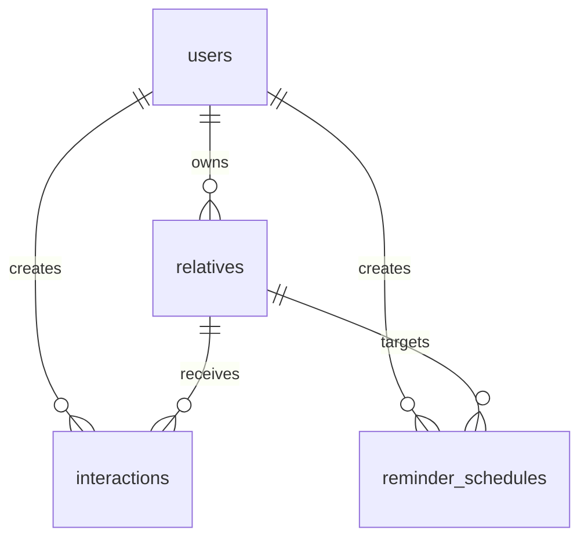
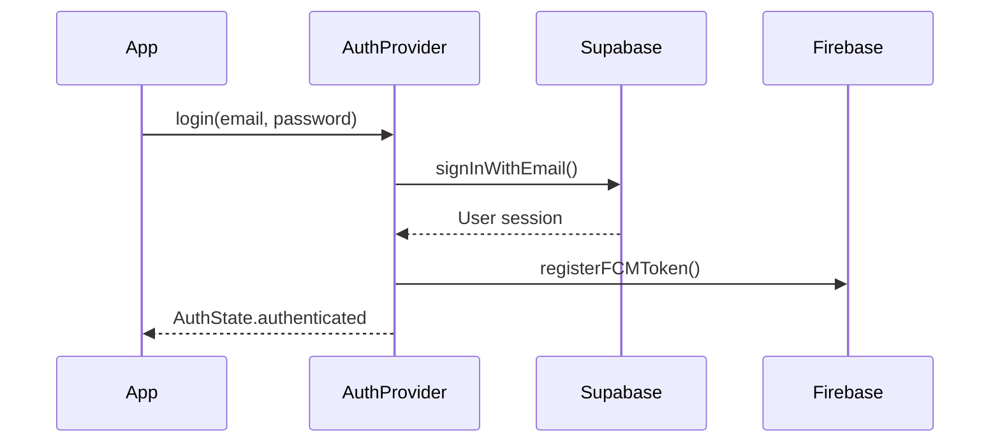

# Silni App - Technical Architecture Documentation

## Overview

Silni (صِلْني) is a comprehensive Islamic family connection tracker built with Flutter and Supabase. This document provides a detailed technical overview of the application architecture, design patterns, and implementation details.

## Table of Contents

1. [System Architecture](#system-architecture)
2. [Technology Stack](#technology-stack)
3. [Application Structure](#application-structure)
4. [Data Architecture](#data-architecture)
5. [State Management](#state-management)
6. [Authentication & Security](#authentication--security)
7. [Offline Support](#offline-support)
8. [Real-time Features](#real-time-features)
9. [Performance Monitoring](#performance-monitoring)
10. [Error Handling](#error-handling)
11. [Internationalization](#internationalization)
12. [AI Integration](#ai-integration)

---

## System Architecture

### High-Level Architecture

```
┌─────────────────────────────────────────────────────────────┐
│                    Mobile App (Flutter)                  │
├─────────────────────────────────────────────────────────────┤
│  ┌─────────────┐  ┌─────────────┐  ┌─────────────┐    │
│  │   UI Layer  │  │ Business    │  │   Data      │    │
│  │             │  │ Logic       │  │ Layer       │    │
│  │ - Screens   │  │ - Services  │  │ - Models    │    │
│  │ - Widgets   │  │ - Providers │  │ - Repos     │    │
│  └─────────────┘  └─────────────┘  └─────────────┘    │
└─────────────────────────────────────────────────────────────┘
                              │
                              ▼
┌─────────────────────────────────────────────────────────────┐
│                    Backend Services                       │
├─────────────────────────────────────────────────────────────┤
│  ┌─────────────┐  ┌─────────────┐  ┌─────────────┐    │
│  │  Supabase   │  │  Firebase   │  │   Sentry    │    │
│  │             │  │             │  │             │    │
│  │ - Auth      │  │ - FCM       │  │ - Error     │    │
│  │ - Database  │  │ - Analytics │  │ Tracking    │    │
│  │ - Storage   │  │ - Perf      │  │             │    │
│  │ - Realtime  │  │ Monitoring  │  │             │    │
│  └─────────────┘  └─────────────┘  └─────────────┘    │
└─────────────────────────────────────────────────────────────┘
```

### Architecture Principles

1. **Feature-Based Organization**: Code is organized by features rather than technical layers
2. **Separation of Concerns**: Clear boundaries between UI, business logic, and data
3. **Dependency Injection**: Riverpod provides clean dependency management
4. **Type Safety**: Strong typing throughout the application
5. **Offline-First**: Local caching with sync capabilities
6. **Reactive Programming**: Streams for real-time updates

---

## Technology Stack

### Frontend (Mobile App)

| Technology | Version | Purpose |
|------------|----------|---------|
| **Flutter** | ^3.10.1 | Cross-platform mobile framework |
| **Dart** | ^3.10.1 | Programming language |
| **Riverpod** | ^2.6.1 | State management and dependency injection |
| **Go Router** | ^14.8.1 | Declarative routing and navigation |
| **Hive** | ^2.2.3 | Local storage and caching |
| **Firebase Messaging** | ^15.2.10 | Push notifications |
| **Sentry** | ^9.9.0 | Error tracking and performance monitoring |

### Backend Services

| Service | Purpose | Features Used |
|---------|---------|---------------|
| **Supabase** | Primary backend | Auth, PostgreSQL, Storage, Realtime |
| **Firebase** | Complementary services | FCM, Analytics, Performance |
| **Sentry** | Monitoring | Error tracking, performance monitoring |

### Development Tools

| Tool | Purpose |
|------|---------|
| **envied** | Type-safe environment variables |
| **build_runner** | Code generation |
| **mocktail** | Testing framework |
| **integration_test** | End-to-end testing |

---

## Application Structure

### Directory Organization

```
lib/
├── main.dart                    # App entry point
├── core/                       # Shared core functionality
│   ├── ai/                     # AI services and models
│   ├── cache/                  # Local storage management
│   ├── config/                 # App configuration
│   ├── constants/              # App constants
│   ├── errors/                 # Error handling
│   ├── extensions/             # Dart extensions
│   ├── models/                 # Core models
│   ├── providers/              # Global providers
│   ├── router/                 # Navigation
│   ├── services/               # Core services
│   ├── theme/                  # Theming
│   └── utils/                  # Utilities
├── features/                   # Feature modules
│   ├── ai_assistant/           # AI-powered features
│   ├── auth/                  # Authentication
│   ├── contacts/              # Contact import
│   ├── family_tree/           # Family tree visualization
│   ├── gamification/          # Gamification system
│   ├── home/                  # Home screen
│   ├── notifications/          # Notifications
│   ├── profile/               # User profile
│   ├── relatives/             # Family member management
│   ├── reminders/             # Reminder system
│   ├── settings/              # App settings
│   └── statistics/            # Analytics and stats
└── shared/                    # Shared components
    ├── models/                # Shared data models
    ├── providers/             # Shared providers
    ├── repositories/          # Data repositories
    ├── services/              # Shared services
    ├── utils/                 # UI helpers
    └── widgets/               # Reusable widgets
```

### Feature Module Structure

Each feature follows a consistent structure:

```
feature_name/
├── providers/                 # Riverpod providers
├── screens/                  # UI screens
├── widgets/                  # Feature-specific widgets
└── services/                 # Feature-specific services
```

---

## Data Architecture

### Database Schema (Supabase PostgreSQL)

#### Core Tables

1. **users** - User profiles and gamification data
2. **relatives** - Family member information
3. **interactions** - Communication tracking
4. **reminder_schedules** - Reminder configurations
5. **hadith** - Islamic content

#### Relationships



### Data Models

#### Relative Model

```dart
class Relative {
  final String id;
  final String userId;
  final String fullName;
  final RelationshipType relationshipType;
  final Gender? gender;
  final AvatarType? avatarType;
  final DateTime? dateOfBirth;
  final String? phoneNumber;
  final String? email;
  final String? address;
  final String? city;
  final String? country;
  final String? photoUrl;
  final String? notes;
  final int priority; // 1 = high, 2 = medium, 3 = low
  final String? islamicImportance;
  final String? preferredContactMethod;
  final String? bestTimeToContact;
  final int interactionCount;
  final DateTime? lastContactDate;
  final String? healthStatus;
  final bool isArchived;
  final bool isFavorite;
  final String? contactId;
  final DateTime createdAt;
  final DateTime? updatedAt;
  
  // AI-Optimized Fields
  final List<String>? interests;
  final List<String>? favoriteColors;
  final List<String>? favoriteFoods;
  final String? clothingSize;
  final String? giftBudget;
  final List<String>? dislikedGifts;
  final List<String>? wishlist;
  final String? personalityType;
  final String? communicationStyle;
  final List<String>? sensitiveTopics;
  final String? relationshipChallenges;
  final String? relationshipStrengths;
  final String? aiNotes;
  final int? emotionalCloseness;
  final int? communicationQuality;
  final String? conflictHistory;
  final int? supportLevel;
  final DateTime? lastMeaningfulInteraction;
}
```

#### Interaction Model

```dart
class Interaction {
  final String id;
  final String userId;
  final String relativeId;
  final InteractionType type;
  final DateTime date;
  final int? duration; // in minutes
  final String? location;
  final String? notes;
  final String? mood;
  final List<String> photoUrls;
  final int? rating; // 1-5
  final bool isRecurring;
  final DateTime createdAt;
  final DateTime? updatedAt;
}
```

### Repository Pattern

Services implement the repository pattern for data access:

```dart
class RelativesService {
  final SupabaseClient _supabase = SupabaseConfig.client;
  
  // CRUD operations with retry logic
  Future<String> createRelative(Relative relative);
  Stream<List<Relative>> getRelativesStream(String userId);
  Future<Relative?> getRelative(String relativeId);
  Future<void> updateRelative(String relativeId, Map<String, dynamic> updates);
  Future<void> deleteRelative(String relativeId);
}
```

---

## State Management

### Riverpod Architecture

Silni uses Riverpod for reactive state management with the following patterns:

#### Provider Types

1. **Provider** - For immutable dependencies
```dart
final relativesServiceProvider = Provider<RelativesService>((ref) {
  return RelativesService();
});
```

2. **StateNotifierProvider** - For mutable state
```dart
final authProvider = StateNotifierProvider<AuthNotifier, AuthState>((ref) {
  return AuthNotifier(ref.read(authServiceProvider));
});
```

3. **StreamProvider** - For real-time data
```dart
final relativesProvider = StreamProvider<List<Relative>>((ref) {
  final userId = ref.watch(authProvider).currentUser?.id;
  if (userId == null) return Stream.value([]);
  return ref.watch(relativesServiceProvider).getRelativesStream(userId);
});
```

4. **AsyncNotifierProvider** - For async state with loading/error states
```dart
final interactionsProvider = AsyncNotifierProvider<InteractionsNotifier, List<Interaction>>((ref) {
  return InteractionsNotifier(ref);
});
```

### State Flow

```
UI Event → Provider Action → Service Call → Database Update → Stream Update → UI Rebuild
```

---

## Subscription Architecture

### Two-Tier Model

Silni uses a simple two-tier subscription model integrated with RevenueCat:

| Tier | Features | Reminder Limit |
|------|----------|----------------|
| **Free** | Family management, Family tree, Custom themes | 3 |
| **MAX** | All Free features + All AI features + Advanced analytics | Unlimited |

### RevenueCat Integration

```
┌─────────────────────────────────────────────────────────────┐
│                 Subscription Architecture                   │
├─────────────────────────────────────────────────────────────┤
│  ┌─────────────────┐    ┌─────────────────┐                │
│  │  RevenueCat SDK │◄───│  App Store /    │                │
│  │                 │    │  Google Play    │                │
│  │ - Customer Info │    └─────────────────┘                │
│  │ - Entitlements  │                                       │
│  │ - Offerings     │                                       │
│  └────────┬────────┘                                       │
│           │                                                 │
│           ▼                                                 │
│  ┌────────────────────┐                                    │
│  │ SubscriptionService│  (Singleton)                       │
│  │                    │                                    │
│  │ - initialize()     │                                    │
│  │ - purchase()       │                                    │
│  │ - restore()        │                                    │
│  │ - stateStream      │                                    │
│  └────────┬───────────┘                                    │
│           │                                                 │
│           ▼                                                 │
│  ┌────────────────────────────────────────────┐            │
│  │ Riverpod Providers (Reactive UI)           │            │
│  │                                            │            │
│  │ subscriptionStateProvider (StreamProvider) │            │
│  │ subscriptionTierProvider (Provider)        │            │
│  │ isMaxProvider (Provider<bool>)             │            │
│  │ featureAccessProvider (Provider.family)    │            │
│  └────────────────────────────────────────────┘            │
└─────────────────────────────────────────────────────────────┘
```

### Key Components

#### SubscriptionService (Singleton)

```dart
class SubscriptionService {
  // Singleton access
  static SubscriptionService get instance;

  // State management
  Stream<SubscriptionState> get stateStream;
  SubscriptionState get currentState;

  // Initialization
  Future<void> initialize({String? userId});

  // Purchases
  Future<bool> purchase(Package package);
  Future<bool> restorePurchases();

  // Feature access
  bool hasFeatureAccess(String featureId);
  int get reminderLimit;
}
```

#### SubscriptionState (Immutable)

```dart
class SubscriptionState {
  final SubscriptionTier tier;      // free or max
  final bool isActive;              // Has active subscription
  final DateTime? expirationDate;   // When subscription expires
  final bool isTrialActive;         // In free trial
  final int trialDaysRemaining;     // Days left in trial
  final String? productId;          // RevenueCat product ID
  final Offerings? offerings;       // Available packages
  final bool isLoading;             // Loading state
  final String? error;              // Error message (Arabic)
}
```

#### SubscriptionTier (Enum)

```dart
enum SubscriptionTier {
  free,  // Basic features
  max,   // All features (AI + unlimited)
}

extension SubscriptionTierExtension on SubscriptionTier {
  // Feature access checks
  bool get hasAIChat;
  bool get hasMessageComposer;
  bool get hasCommunicationScripts;
  bool get hasRelationshipAnalysis;
  bool get hasUnlimitedReminders;

  // Limits
  int get reminderLimit;  // 3 for free, -1 (unlimited) for max
}
```

### Provider Hierarchy

| Provider | Type | Purpose |
|----------|------|---------|
| `subscriptionServiceProvider` | Provider | Singleton service access |
| `subscriptionStateProvider` | StreamProvider | Reactive state stream |
| `subscriptionTierProvider` | Provider | Current tier (derived) |
| `isMaxProvider` | Provider<bool> | Quick MAX check |
| `isTrialActiveProvider` | Provider<bool> | Trial status |
| `trialDaysRemainingProvider` | Provider<int> | Trial countdown |
| `featureAccessProvider` | Provider.family<bool, String> | Per-feature gating |
| `reminderLimitProvider` | Provider<int> | Current tier's limit |
| `offeringsProvider` | Provider | Available packages |

### Feature IDs

```dart
class FeatureIds {
  // MAX-only AI features
  static const String aiChat = 'ai_chat';
  static const String messageComposer = 'message_composer';
  static const String communicationScripts = 'communication_scripts';
  static const String relationshipAnalysis = 'relationship_analysis';
  static const String smartRemindersAI = 'smart_reminders_ai';
  static const String weeklyReports = 'weekly_reports';

  // MAX-only other features
  static const String advancedAnalytics = 'advanced_analytics';
  static const String leaderboard = 'leaderboard';
  static const String dataExport = 'data_export';
  static const String unlimitedReminders = 'unlimited_reminders';

  // Free features
  static const String customThemes = 'custom_themes';
  static const String familyTree = 'family_tree';
}
```

---

## Offline-First Architecture

### Architecture Overview

Silni implements a comprehensive offline-first strategy with local caching and background synchronization:

```
┌─────────────────────────────────────────────────────────────┐
│                 Offline-First Architecture                  │
├─────────────────────────────────────────────────────────────┤
│                                                             │
│  ┌─────────────┐     ┌─────────────┐     ┌─────────────┐  │
│  │    UI       │────▶│ Repository  │────▶│   Cache     │  │
│  │   Layer     │     │   Layer     │     │  (Hive)     │  │
│  └─────────────┘     └──────┬──────┘     └─────────────┘  │
│                             │                              │
│                             ▼                              │
│  ┌──────────────────────────────────────────────────────┐ │
│  │              SyncService (Orchestrator)              │ │
│  │                                                      │ │
│  │  ┌────────────────┐    ┌────────────────────────┐   │ │
│  │  │ Connectivity   │    │  OfflineQueueService   │   │ │
│  │  │ Service        │    │                        │   │ │
│  │  │                │    │  - FIFO Queue          │   │ │
│  │  │ - isOnline     │    │  - Retry Logic         │   │ │
│  │  │ - statusStream │    │  - Dead Letter Queue   │   │ │
│  │  └────────────────┘    └────────────────────────┘   │ │
│  └──────────────────────────────────────────────────────┘ │
│                             │                              │
│                             ▼                              │
│                    ┌─────────────────┐                    │
│                    │    Supabase     │                    │
│                    │    (Remote)     │                    │
│                    └─────────────────┘                    │
└─────────────────────────────────────────────────────────────┘
```

### Cache-First Read Strategy

Repositories implement a cache-first strategy for optimal performance:

```dart
Stream<List<Relative>> watchRelatives(String userId) async* {
  // 1. Emit cached data immediately (< 10ms)
  yield _cache.getRelatives(userId);

  // 2. Check if cache is stale (> 5 minutes)
  if (_cache.isStale(userId) && _connectivity.isOnline) {
    // 3. Sync from server in background
    await _syncService.syncRelatives(userId);
    yield _cache.getRelatives(userId);
  }

  // 4. Stream real-time updates
  await for (final data in _realtimeService.relativesStream(userId)) {
    await _cache.putRelatives(userId, data);
    yield data;
  }
}
```

### OfflineQueueService

Manages offline operations with FIFO queue, exponential backoff, and dead-letter handling:

```dart
class OfflineQueueService {
  // Enqueue operation for later sync
  Future<int> enqueue(OfflineOperation operation);

  // Process queue (called when online)
  Future<int> processQueue({
    Future<void> Function(OfflineOperation)? operationExecutor,
  });

  // Queue inspection
  List<OfflineOperation> getPendingOperations();
  List<OfflineOperation> getDeadLetterOperations();
  int getPendingCount();
  int getDeadLetterCount();

  // Dead letter management
  Future<void> retryDeadLetter(int operationId);
  Future<void> clearDeadLetter(int operationId);
}
```

### OfflineOperation Model

```dart
class OfflineOperation {
  final int id;
  final OperationType type;        // create, update, delete
  final String entityType;         // relative, interaction, etc.
  final String entityId;
  final Map<String, dynamic> data;
  final DateTime createdAt;
  final int retryCount;
  final String? lastError;
  final bool isDeadLetter;
}
```

### Retry Strategy

| Attempt | Delay | Notes |
|---------|-------|-------|
| 1 | ~1 second | Initial delay with jitter |
| 2 | ~2 seconds | Exponential backoff |
| 3 | ~4 seconds | Exponential backoff |
| 4 | ~8 seconds | Exponential backoff |
| 5 | ~16 seconds | Final attempt |
| Failed | Dead Letter | Manual retry required |

### Cache Configuration

```dart
class CacheConfig {
  // Box names
  static const String relativesBox = 'relatives';
  static const String interactionsBox = 'interactions';
  static const String reminderSchedulesBox = 'reminder_schedules';
  static const String offlineQueueBox = 'offline_queue';
  static const String syncMetadataBox = 'sync_metadata';

  // Limits
  static const int maxInteractionsPerRelative = 100;
  static const Duration staleCacheThreshold = Duration(minutes: 5);
  static const Duration backgroundSyncInterval = Duration(minutes: 5);

  // Retry settings
  static const int maxRetryAttempts = 5;
  static const Duration initialRetryDelay = Duration(seconds: 1);
  static const double retryBackoffMultiplier = 2.0;
}
```

---

## Real-time Features

### Supabase Realtime Integration

Silni uses Supabase real-time subscriptions for live data synchronization:

```
┌─────────────────────────────────────────────────────────────┐
│               Real-Time Synchronization                     │
├─────────────────────────────────────────────────────────────┤
│                                                             │
│  ┌─────────────────────────────────────────────────────┐   │
│  │              PostgreSQL (Supabase)                  │   │
│  │                                                     │   │
│  │  LISTEN/NOTIFY on table changes                     │   │
│  │  - relatives: INSERT, UPDATE, DELETE               │   │
│  │  - interactions: INSERT, UPDATE, DELETE            │   │
│  │  - reminder_schedules: INSERT, UPDATE, DELETE      │   │
│  │  - users: UPDATE                                   │   │
│  └───────────────────────┬─────────────────────────────┘   │
│                          │ WebSocket                       │
│                          ▼                                 │
│  ┌─────────────────────────────────────────────────────┐   │
│  │            RealtimeService (Client)                 │   │
│  │                                                     │   │
│  │  subscribeToRelatives(userId, callback)            │   │
│  │  subscribeToInteractions(userId, callback)         │   │
│  │  subscribeToReminderSchedules(userId, callback)    │   │
│  │  subscribeToUserProfile(userId, callback)          │   │
│  └───────────────────────┬─────────────────────────────┘   │
│                          │                                 │
│                          ▼                                 │
│  ┌─────────────────────────────────────────────────────┐   │
│  │     RealtimeSubscriptionsNotifier (StateNotifier)   │   │
│  │                                                     │   │
│  │  - Manages subscription lifecycle                   │   │
│  │  - Invalidates Riverpod providers on changes        │   │
│  │  - Auto-reconnection handling                       │   │
│  └───────────────────────┬─────────────────────────────┘   │
│                          │                                 │
│                          ▼                                 │
│  ┌─────────────────────────────────────────────────────┐   │
│  │              Riverpod Providers (UI)                │   │
│  │                                                     │   │
│  │  ref.invalidate(relativesStreamProvider)           │   │
│  │  ref.invalidate(interactionsStreamProvider)        │   │
│  │  ref.invalidate(reminderSchedulesStreamProvider)   │   │
│  └─────────────────────────────────────────────────────┘   │
└─────────────────────────────────────────────────────────────┘
```

### RealtimeSubscriptionsNotifier

```dart
class RealtimeSubscriptionsNotifier extends StateNotifier<Map<String, RealtimeChannel>> {
  /// Subscribe to all tables for a user
  Future<void> subscribeToUserUpdates(String userId) async {
    // Subscribe to relatives changes
    final relativesChannel = _realtimeService.subscribeToRelatives(userId, (payload) {
      _ref.invalidate(relativesStreamProvider(userId));
    });

    // Subscribe to interactions changes
    final interactionsChannel = _realtimeService.subscribeToInteractions(userId, (payload) {
      _ref.invalidate(todayInteractionsStreamProvider(userId));
      _ref.invalidate(todayContactedRelativesProvider(userId));
    });

    // Subscribe to reminder schedules
    final schedulesChannel = _realtimeService.subscribeToReminderSchedules(userId, (payload) {
      _ref.invalidate(reminderSchedulesStreamProvider(userId));
    });

    // Store channels for cleanup
    state = {
      'relatives': relativesChannel,
      'interactions': interactionsChannel,
      'reminderSchedules': schedulesChannel,
    };
  }

  /// Cleanup all subscriptions
  void unsubscribeFromAll() {
    _realtimeService.disposeAll();
    state = {};
  }
}
```

### Auto Real-Time Provider

Automatically manages subscriptions based on auth state:

```dart
final autoRealtimeSubscriptionsProvider = Provider<void>((ref) {
  ref.listen(authStateProvider, (previous, next) {
    if (next.value != null) {
      // User logged in - setup subscriptions
      ref.read(realtimeSubscriptionsProvider.notifier)
          .subscribeToUserUpdates(next.value!.id);
    } else {
      // User logged out - cleanup
      ref.read(realtimeSubscriptionsProvider.notifier)
          .unsubscribeFromAll();
    }
  });
});
```

### Real-time Features Summary

| Table | Events | Provider Invalidated |
|-------|--------|---------------------|
| relatives | INSERT, UPDATE, DELETE | relativesStreamProvider |
| interactions | INSERT, UPDATE, DELETE | todayInteractionsStreamProvider, todayContactedRelativesProvider |
| reminder_schedules | INSERT, UPDATE, DELETE | reminderSchedulesStreamProvider |
| users | UPDATE | Auth state refresh |

---

## Pattern Animation System

### Overview

The Islamic pattern background supports multiple animation effects for visual enhancement:

```
┌─────────────────────────────────────────────────────────────┐
│               Pattern Animation System                      │
├─────────────────────────────────────────────────────────────┤
│                                                             │
│  ┌─────────────────────────────────────────────────────┐   │
│  │           PatternAnimationSettings                  │   │
│  │                                                     │   │
│  │  rotationEnabled: bool      (slow rotation)         │   │
│  │  pulseEnabled: bool         (breathing opacity)     │   │
│  │  parallaxEnabled: bool      (scroll parallax)       │   │
│  │  shimmerEnabled: bool       (wave effect)           │   │
│  │  touchRippleEnabled: bool   (tap ripples)           │   │
│  │  gyroscopeEnabled: bool     (device motion)         │   │
│  │  followTouchEnabled: bool   (touch glow)            │   │
│  │  animationIntensity: double (0.0-1.0)               │   │
│  └───────────────────────┬─────────────────────────────┘   │
│                          │                                 │
│                          ▼                                 │
│  ┌─────────────────────────────────────────────────────┐   │
│  │       PatternAnimationNotifier (StateNotifier)      │   │
│  │                                                     │   │
│  │  - Loads/saves settings (SharedPreferences)         │   │
│  │  - Toggle individual effects                        │   │
│  │  - Enable/disable all                               │   │
│  └───────────────────────┬─────────────────────────────┘   │
│                          │                                 │
│                          ▼                                 │
│  ┌─────────────────────────────────────────────────────┐   │
│  │    AnimatedIslamicPatternBackground (Widget)        │   │
│  │                                                     │   │
│  │  - Applies enabled animations                       │   │
│  │  - Handles lifecycle (pause when backgrounded)      │   │
│  │  - Touch event handling                             │   │
│  └───────────────────────┬─────────────────────────────┘   │
│                          │                                 │
│                          ▼                                 │
│  ┌─────────────────────────────────────────────────────┐   │
│  │          GyroscopeService (Optional)                │   │
│  │                                                     │   │
│  │  - Device sensor access                             │   │
│  │  - Normalized data stream                           │   │
│  │  - Smoothing algorithms                             │   │
│  └─────────────────────────────────────────────────────┘   │
└─────────────────────────────────────────────────────────────┘
```

### Animation Types

| Animation | Description | Default | Battery Impact |
|-----------|-------------|---------|----------------|
| **Rotation** | Slow continuous rotation | ON | Low |
| **Pulse** | Breathing opacity effect | ON | Low |
| **Parallax** | Scroll-based offset | ON | Low |
| **Shimmer** | Wave effect across pattern | OFF | Medium |
| **Touch Ripple** | Tap-triggered ripples | ON | Low |
| **Gyroscope** | Device motion parallax | OFF | Medium |
| **Follow Touch** | Glow follows finger | ON | Low |

### PatternAnimationSettings

```dart
@immutable
class PatternAnimationSettings {
  final bool rotationEnabled;
  final bool pulseEnabled;
  final bool parallaxEnabled;
  final bool shimmerEnabled;
  final bool touchRippleEnabled;
  final bool gyroscopeEnabled;
  final bool followTouchEnabled;
  final double animationIntensity;  // 0.0-1.0

  /// Check if any animation is enabled
  bool get hasAnyAnimationEnabled;

  /// Check if any touch effect is enabled
  bool get hasTouchEffectsEnabled;

  /// Master animation enabled check
  bool get isAnimationEnabled;
}
```

### Provider Usage

```dart
// Watch settings
final settings = ref.watch(patternAnimationProvider);

// Toggle effects
ref.read(patternAnimationProvider.notifier).toggleGyroscope();
ref.read(patternAnimationProvider.notifier).toggleShimmer();

// Set intensity
ref.read(patternAnimationProvider.notifier).setIntensity(0.5);

// Enable/disable all
ref.read(patternAnimationProvider.notifier).enableAll();
ref.read(patternAnimationProvider.notifier).disableAll();

// Convenience providers
final isEnabled = ref.watch(isPatternAnimationEnabledProvider);
final hasTouchEffects = ref.watch(isTouchEffectsEnabledProvider);
```

### Performance Considerations

1. **Battery Efficiency**: Shimmer and gyroscope are OFF by default
2. **Lifecycle Management**: Animations pause when app is backgrounded
3. **Fallback**: Falls back to static patterns if all animations disabled
4. **Persistence**: Settings saved to SharedPreferences
5. **Intensity Control**: Master intensity slider (0.0-1.0) scales all effects

---

## Authentication & Security

### Authentication Flow



### Security Measures

1. **Row Level Security (RLS)** - Database-level access control
2. **Environment Variables** - Type-safe secret management with `envied`
3. **Session Management** - Secure token handling with auto-refresh
4. **Biometric Authentication** - Local device authentication
5. **Input Validation** - Client and server-side validation
6. **SQL Injection Prevention** - ORM-based queries

### Security Rules

#### Firestore Rules (for Firebase integration)

```javascript
rules_version = '2';

service cloud.firestore {
  match /databases/{database}/documents {
    // Helper functions
    function isAuthenticated() {
      return request.auth != null;
    }
    
    function isOwner(userId) {
      return isAuthenticated() && request.auth.uid == userId;
    }
    
    // Users collection
    match /users/{userId} {
      allow read: if isOwner(userId);
      allow create: if isOwner(userId) && 
                      request.resource.data.email is string &&
                      request.resource.data.fullName is string;
      allow update: if isOwner(userId);
      allow delete: if false;
    }
    
    // Similar rules for other collections...
  }
}
```

---

## Offline Support

### Local Storage Architecture

```
┌─────────────────────────────────────────┐
│           Local Storage (Hive)          │
├─────────────────────────────────────────┤
│ ┌─────────────┐ ┌─────────────────────┐ │
│ │   Cache     │ │   Offline Queue      │ │
│ │             │ │                     │ │
│ │ - Relatives │ │ - Pending Creates   │ │
│ │ - Interactions │ │ - Pending Updates  │ │
│ │ - User Data │ │ - Pending Deletes   │ │
│ └─────────────┘ └─────────────────────┘ │
└─────────────────────────────────────────┘
```

### Sync Strategy

1. **Write-Through Cache**: Immediate local write, then sync to server
2. **Offline Queue**: Operations queued when offline
3. **Exponential Backoff**: Retry with increasing delays
4. **Conflict Resolution**: Last-write-wins with timestamps
5. **Sync Status**: Visual indicators for sync state

### Implementation

```dart
class SyncService {
  static final SyncService instance = SyncService._();
  SyncService._();
  
  Future<void> initialize() async {
    // Initialize Hive and adapters
    await HiveInitializer.initialize();
    
    // Start background sync
    _startBackgroundSync();
  }
  
  Future<void> queueOperation(OfflineOperation operation) async {
    // Add to offline queue
    await _operationQueue.add(operation);
    
    // Try immediate sync if online
    if (await _connectivityService.hasConnection()) {
      await _processQueue();
    }
  }
}
```

---

## Real-time Features

### Supabase Realtime Integration

```dart
class RealtimeService {
  void initializeSubscriptions() {
    // Listen for relative changes
    _supabase.channel('relatives')
      .onPostgresChanges(
        event: PostgresChangeEvent.all,
        schema: 'public',
        table: 'relatives',
        callback: (payload) => _handleRelativeChange(payload),
      )
      .subscribe();
      
    // Similar subscriptions for other tables
  }
}
```

### Real-time Features

1. **Family Updates**: Real-time sync of relative information
2. **Interaction Tracking**: Live updates of communication logs
3. **Reminder Changes**: Instant reminder updates
4. **Gamification**: Live achievement unlocks
5. **AI Insights**: Real-time relationship analysis

---

## Performance Monitoring

### Monitoring Stack

```
┌─────────────────────────────────────────┐
│         Performance Monitoring          │
├─────────────────────────────────────────┤
│ ┌─────────────┐ ┌─────────────────────┐ │
│ │   Sentry    │ │   Custom Metrics    │ │
│ │             │ │                     │ │
│ │ - Errors    │ │ - Database Timing   │ │
│ │ - Crashes   │ │ - API Response     │ │
│ │ - Performance│ │ - Frame Rate       │ │
│ │ - User      │ │ - Memory Usage     │ │
│ │   Sessions  │ │ - Battery Impact   │ │
│ └─────────────┘ └─────────────────────┘ │
└─────────────────────────────────────────┘
```

### Performance Metrics

1. **Database Operations**: Query timing and optimization
2. **UI Performance**: Frame rate and jank detection
3. **Network Performance**: API response times
4. **Memory Usage**: Memory leaks and optimization
5. **Battery Impact**: Power consumption monitoring

### Implementation

```dart
class PerformanceMonitoringService {
  Future<T> measureDatabaseOperation<T>(
    String operation,
    String table,
    Future<T> Function() operationFn,
  ) async {
    final stopwatch = Stopwatch()..start();
    try {
      final result = await operationFn();
      stopwatch.stop();
      
      // Log to Sentry
      await Sentry.addBreadcrumb(
        Breadcrumb(
          message: 'Database operation completed',
          category: 'db',
          data: {
            'operation': operation,
            'table': table,
            'duration_ms': stopwatch.elapsedMilliseconds,
          },
        ),
      );
      
      return result;
    } catch (e, stackTrace) {
      stopwatch.stop();
      
      // Log error with performance context
      await Sentry.captureException(
        e,
        stackTrace: stackTrace,
        hint: Hint.withMap({
          'operation': operation,
          'table': table,
          'duration_ms': stopwatch.elapsedMilliseconds,
        }),
      );
      
      rethrow;
    }
  }
}
```

---

## Error Handling

### Error Hierarchy

```dart
// Base error class
abstract class AppError implements Exception {
  final String message;
  final String arabicMessage;
  final String? component;
  final Object? originalError;
  final StackTrace? stackTrace;
  
  const AppError({
    required this.message,
    required this.arabicMessage,
    this.component,
    this.originalError,
    this.stackTrace,
  });
}

// Specific error types
class NetworkError extends AppError { ... }
class DatabaseError extends AppError { ... }
class ValidationError extends AppError { ... }
class AuthenticationError extends AppError { ... }
class ConfigurationError extends AppError { ... }
```

### Error Handling Strategy

1. **Global Error Handlers**: Catch unhandled errors
2. **Error Boundaries**: Isolate errors to specific UI sections
3. **Graceful Degradation**: Continue functioning with reduced features
4. **User-Friendly Messages**: Localized error messages
5. **Error Reporting**: Automatic reporting to Sentry

### Implementation

```dart
// Global error handler in main.dart
FlutterError.onError = (FlutterErrorDetails details) async {
  // Log locally
  logger.critical('Flutter Error: ${details.exceptionAsString()}');
  
  // Send to Sentry
  await Sentry.captureException(details.exception, stackTrace: details.stack);
};

// Error boundary widget
class ErrorBoundary extends ConsumerWidget {
  @override
  Widget build(BuildContext context, WidgetRef ref) {
    return ref.watch(errorProvider).when(
      data: (data) => child,
      loading: () => const LoadingWidget(),
      error: (error, stack) => ErrorWidget(
        error: error,
        onRetry: () => ref.read(errorProvider.notifier).retry(),
      ),
    );
  }
}
```

---

## Internationalization

### RTL Support

Silni is designed for Arabic users with comprehensive RTL support:

1. **Text Direction**: RTL layout throughout the app
2. **Font Support**: Arabic-optimized typography
3. **Date Formatting**: Hijri calendar support
4. **Number Formatting**: Arabic numeral support
5. **Content Localization**: All UI text in Arabic

### Implementation

```dart
class SilniApp extends ConsumerWidget {
  @override
  Widget build(BuildContext context, WidgetRef ref) {
    return MaterialApp.router(
      builder: (context, child) {
        return Directionality(
          textDirection: TextDirection.rtl, // Arabic RTL
          child: child!,
        );
      },
      // ... other configuration
    );
  }
}
```

---

## AI Integration

### AI Architecture

```
┌─────────────────────────────────────────┐
│            AI Integration              │
├─────────────────────────────────────────┤
│ ┌─────────────┐ ┌─────────────────────┐ │
│ │ DeepSeek AI │ │   Local Processing  │ │
│ │             │ │                     │ │
│ │ - Chat      │ │ - Relationship     │ │
│ │ - Analysis  │ │   Analysis         │ │
│ │ - Insights  │ │ - Gift             │ │
│ │ - Scripts   │ │   Recommendations  │ │
│ └─────────────┘ └─────────────────────┘ │
└─────────────────────────────────────────┘
```

### AI Features

1. **Relationship Analysis**: AI-powered relationship health scoring
2. **Gift Recommendations**: Personalized gift suggestions
3. **Communication Scripts**: Context-aware message templates
4. **Weekly Reports**: AI-generated family connection summaries
5. **Smart Reminders**: AI-optimized reminder scheduling

### Implementation

```dart
class AIService {
  Future<RelationshipAnalysis> analyzeRelationship(
    String relativeId,
    List<Interaction> interactions,
    Relative relative,
  ) async {
    final prompt = AIPrompts.relationshipAnalysis(
      relative: relative,
      interactions: interactions,
    );
    
    final response = await DeepSeekAIService.chat(prompt);
    return RelationshipAnalysis.fromJson(response);
  }
}
```

---

## Conclusion

Silni's technical architecture is designed to be:

1. **Scalable**: Modular design supports growth
2. **Maintainable**: Clear separation of concerns
3. **Reliable**: Comprehensive error handling and offline support
4. **Performant**: Optimized for mobile devices
5. **Secure**: Enterprise-grade security measures
6. **User-Friendly**: Arabic-first design with RTL support

The architecture supports the app's mission to help Muslims maintain strong family ties through technology while respecting Islamic values and cultural context.