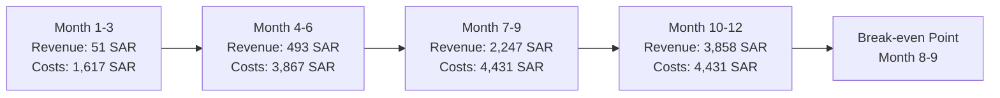
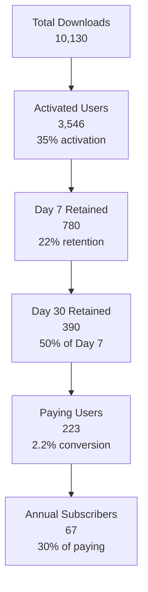
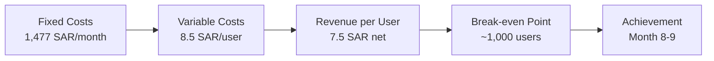
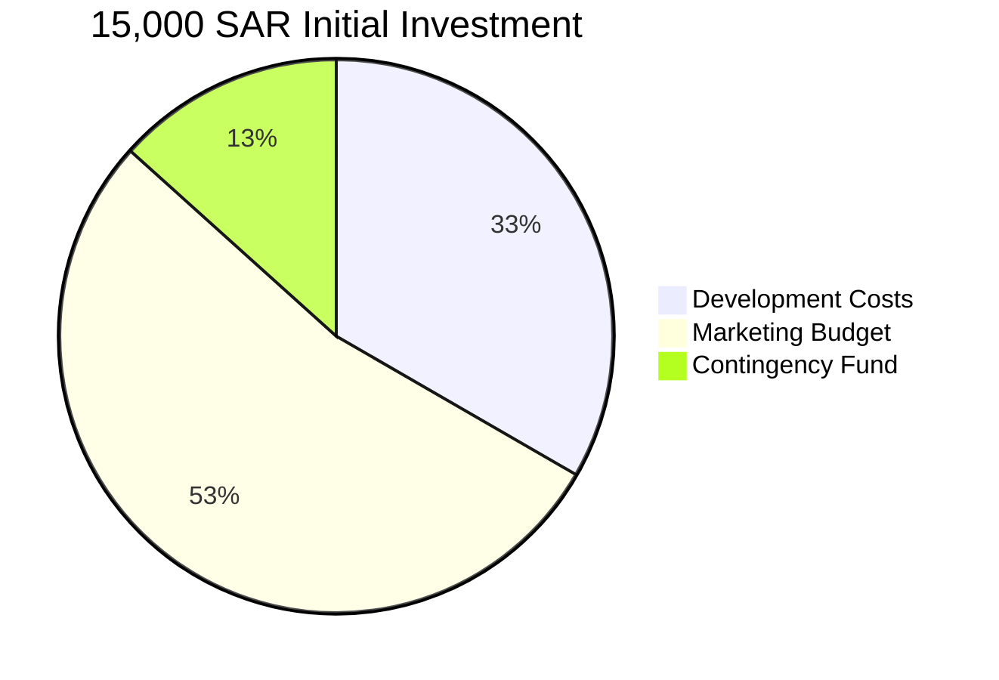

# Silni Financial Dashboard - Key Metrics Summary

## Executive Dashboard

### 12-Month Financial Overview

| Metric | Pessimistic | Base Case | Optimistic |
|--------|-------------|-----------|------------|
| Total Users | 4,915 | 10,130 | 15,195 |
| Paying Users | 39 | 223 | 532 |
| Net Revenue (SAR) | 312 | 5,649 | 13,492 |
| Net Profit/Loss (SAR) | -14,034 | -8,697 | +8,146 |
| Break-even Month | Never | Month 8-9 | Month 6 |

### User Acquisition Metrics

```mermaid
gantt
    title Silni User Growth Projection (Base Case)
    dateFormat X
    axisFormat %m
    section Cumulative Users
    Total Users :active, user1, 0, 110
    Total Users : user2, 1, 285
    Total Users : user3, 2, 530
    Total Users : user4, 3, 910
    Total Users : user5, 4, 1415
    Total Users : user6, 5, 2065
    Total Users : user7, 6, 2880
    Total Users : user8, 7, 3880
    Total Users : user9, 8, 5085
    Total Users : user10, 9, 6515
    Total Users : user11, 10, 8190
    Total Users : user12, 11, 10130
    
    section Paying Users
    Premium Users :active, prem1, 0, 1
    Premium Users : prem2, 1, 2
    Premium Users : prem3, 2, 4
    Premium Users : prem4, 3, 14
    Premium Users : prem5, 4, 21
    Premium Users : prem6, 5, 31
    Premium Users : prem7, 6, 63
    Premium Users : prem8, 7, 85
    Premium Users : prem9, 8, 112
    Premium Users : prem10, 9, 143
    Premium Users : prem11, 10, 180
    Premium Users : prem12, 11, 223
```

### Revenue vs. Costs Timeline

## Key Performance Indicators

### Customer Economics

| Metric | Value | Assessment |
|--------|-------|------------|
| Customer Acquisition Cost (CAC) | 20 SAR | Excellent |
| Lifetime Value (LTV) | 112 SAR | Healthy |
| LTV:CAC Ratio | 5.6:1 | Very Good |
| Months to Payback CAC | 2.2 months | Strong |
| Monthly Churn Rate | 6% | Acceptable |

### Conversion Funnel

## Financial Health Indicators

### Monthly Burn Rate Progression

| Period | Monthly Burn | Cumulative Cash | Runway Remaining |
|--------|--------------|-----------------|------------------|
| Months 1-3 | 539 SAR | -1,571 SAR | 22 months |
| Months 4-6 | 1,289 SAR | -4,995 SAR | 8 months |
| Months 7-12 | 1,477 SAR | -8,447 SAR | 4 months |

### Break-even Analysis

## Risk Assessment Matrix

### Risk vs. Impact Chart

| Risk | Probability | Impact | Risk Score |
|------|-------------|---------|------------|
| Low Organic Reach | High | High | 9/10 |
| Poor Conversion | Medium | High | 6/10 |
| High Churn | Medium | Medium | 4/10 |
| Technical Issues | Low | High | 3/10 |
| Market Competition | Low | High | 2/10 |

## Investment Recommendations

### Capital Allocation Strategy

### Timeline for Founder Transition

| Phase | Duration | Founder Status | Key Milestones |
|-------|----------|----------------|----------------|
| Validation | Months 1-6 | Full-time job | 1,000+ users, 30+ paying |
| Growth | Months 7-9 | Consider part-time | Break-even, 100+ paying |
| Scale | Months 10+ | Potential full-time | Profitability, 200+ paying |

## Decision Framework

### Go/No-Go Checkpoints

**Month 3 Decision Point:**
- ✅ **GO**: ≥300 users, ≥2 paying users, NPS >30
- ⚠️ **ITERATE**: 150-300 users, 1-2 paying users, NPS 20-30
- ❌ **STOP**: <150 users, 0 paying users, NPS <20

**Month 6 Decision Point:**
- ✅ **SCALE**: ≥2,000 users, ≥30 paying users, retention >12%
- ⚠️ **OPTIMIZE**: 1,000-2,000 users, 15-30 paying users, retention 8-12%
- ❌ **PIVOT**: <1,000 users, <15 paying users, retention <8%

## Success Probability Analysis

### Monte Carlo Simulation Results

| Outcome | Probability | Key Drivers |
|---------|-------------|------------|
| High Success (Profit >5K SAR) | 20% | Strong organic growth, high conversion |
| Moderate Success (Break-even) | 50% | Base case assumptions achieved |
| Failure (Loss >10K SAR) | 30% | Poor organic reach, low conversion |

### Expected Value Calculation

**Expected 12-Month Outcome:**
- Weighted average: -6,930 SAR net loss
- With 15,000 SAR investment: 8,070 SAR remaining runway
- Probability of self-sustainability: 70%

---

## Conclusion & Strategic Recommendations

### Key Takeaways

1. **Viable Bootstrap Opportunity**: Strong LTV:CAC ratio indicates sustainable business model
2. **Extended Runway**: 15,000 SAR provides 8-22 months depending on phase
3. **Job Retention Critical**: Founder should maintain employment for first 6-8 months
4. **Validation Focus**: First 3 months critical for product-market fit validation

### Immediate Action Items

1. **Launch MVP** with core family tracking features
2. **Implement Content Marketing** strategy focusing on Islamic family values
3. **Establish Community Partnerships** with mosques and Islamic centers
4. **Set Up Analytics** to track validation metrics from Day 1
5. **Prepare Contingency Plans** for each identified risk

### Success Requirements

- **Must Achieve**: 1,000 users by Month 8, 2%+ conversion rate
- **Should Target**: 1,500 users by Month 6, 3%+ conversion rate
- **Could Exceed**: 2,000 users by Month 6, 4%+ conversion rate

The financial analysis indicates Silni represents a calculated risk with reasonable probability of success, provided the founder maintains financial stability through employment during the critical validation period.